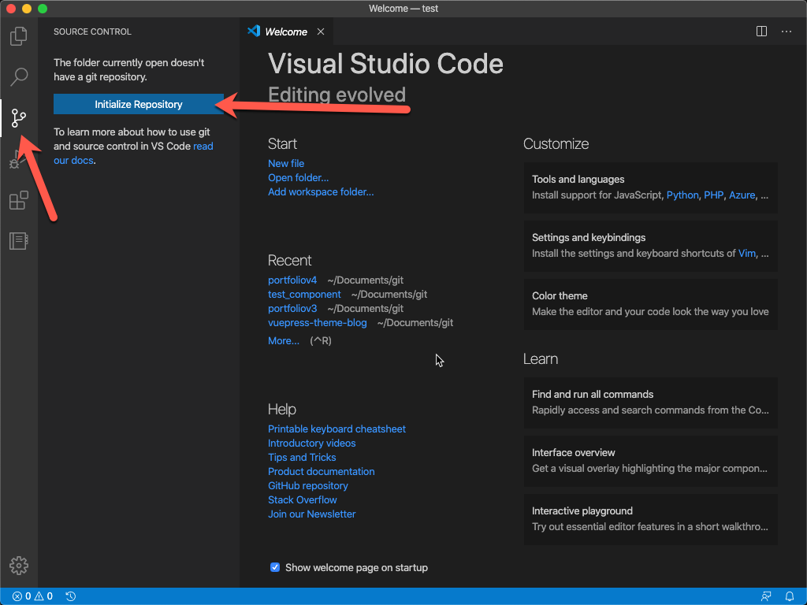

When we left off on Friday, we had got our basic workspace set up to start making Now Experience components! Huzzah! Today I'm going to add just a smidgen more info and suggestions before we get going. 

> This whole blog post is optional, but it's something else that's good to learn!

## Git and Source Code Management

If you read my previous post about setting up your environment, you may (or may not, depending on your skimming) have noticed a few of the applications we were talking about included links to [Github](https://github.com). Github is a website (owned by Microsoft) where you can upload your code, manage versions and collaborate using a tool called [**Git**](https://git-scm.com/). To break it down simply: 

> Git and GitHub let you back up your work, work collaboratively, and manage development over time

I wont go in to too much detail here, as there are [literally millions of articles](https://www.google.com/search?q=how+do+i+use+git) that go into depths we don't really need. So, if you want to start a project (be it a Now Experience module, or otherwise) here are some quick steps:

### 1. Install Git

Waaay back over in [Part 1](../2020-03-20-nowui-part1) we installed the package manager of choice for our Operating System (Homebrew or Chocolatey). Let's use this to install Git by running `brew install git`.

You may notice that your package manager does a quick update before installing Git. This is covered more below.

Once that's done, let's check if it's installed. No prizes for how (it's by running `git --version`):

```
computer:~ aalburydor$ git --version
git version 2.26.0
```

### 2. Make a directory for your work.

This might happen automatically when you run your CLI (as you will see next part), or you might have to do it manually. Each different project will have it's own structure, and you may find it takes a couple of double-nested folders before you get the hang of it. 

Here is also a good time to think of the perfect name for your project. We all know that's impossible, so try keep it simple.

The steps for OSX are: 
``` bash
computer:~ aalburydor$ cd Documents/Git       # A happy place to put all my projects
computer:Git aalburydor$ mkdir test-project   # Making a new folder. Keep these kebab-case :) 
computer:Git aalburydor$ cd test-project      # Change directory to this folder
computer:test-project aalburydor$             # Happy days!
```
On windows the commands are the same, the terminal just looks different ;)

> Hot Tip: Don't make directories for Node projects (Like Now Components) in Cloud Backup folders. It might seem like a good idea to back up your code to Google Drive, but as you will see in my Part 2 blog post, a project could have upwards of 100,00 files in it. That takes *way to long* to sync.


### 3. Open the Directory in Visual Studio Code

If you haven't ever used an "IDE" (Integrated Development Environment) that's another talk for waaay later. Put simply it's a text editor for code with heaps of extra features and plugins. For now - let's get on the same page. Download and install [Visual Studio Code](https://code.visualstudio.com/) (Extra points for using your Package Manager: `brew install visual-studio-code`).

Once it's installed and open, click File / Open Folder and find the folder you created earlier.


### 4. Initialize a new Git Repository (repo)

Next we want to start tracking the directory with the Git tool. To do this, we create a **Repository**. 

Normally, you use Git via the command line, but VS Code has a Git integration built in with buttons! *Everyone loves buttons!*

Click on the Git icon 




---

As for how it works, this bit is often a little harder to understand. Here's something that I didn't know, but once I figured it out kinda crystallized everything in my mind:

> Git creates

## Maintaining Your Workspace (Or: Things Change So Deal With It)

