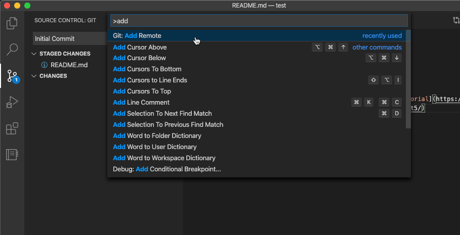

When we left off on Friday, we had got our basic workspace set up to start making Now Experience components! Huzzah! Today I'm going to add just a smidgen more info and suggestions *(Note from Future Andrew: HAHAHA SMIDGEN SORRY IT'S LONGER)* before we get going. 

> This whole blog post is optional, but it's something else that's good to learn!

## Git and Source Code Management

If you read my previous post about setting up your environment, you may (or may not, depending on your skimming) have noticed a few of the applications we were talking about included links to [Github](https://github.com). Github is a website (owned by Microsoft) where you can upload your code, manage versions and collaborate using a tool called [**Git**](https://git-scm.com/). To break it down simply: 

> Git and GitHub let you back up your work, work collaboratively, and manage development over time

I wont go in to too much detail here, as there are [literally millions of articles](https://www.google.com/search?q=how+do+i+use+git) that go into depths we don't really need. So, if you want to start a project (be it a Now Experience module, or otherwise) here are some quick steps:

### 1. Install Git

Waaay back over in [Part 1](../2020-03-20-nowui-part1) we installed the package manager of choice for our Operating System (Homebrew or Chocolatey). Let's use this to install Git by running `brew install git`.

You may notice that your package manager does a quick update before installing Git. This is covered more below.

Once that's done, let's check if it's installed. No prizes for how (it's by running `git --version`):

```
computer:~ aalburydor$ git --version
git version 2.26.0
```

### 2. Make a directory for your work.

This might happen automatically when you run your CLI (as you will see next part), or you might have to do it manually. Each different project will have it's own structure, and you may find it takes a couple of double-nested folders before you get the hang of it. 

Here is also a good time to think of the perfect name for your project. We all know that's impossible, so try keep it simple.

The steps for OSX are: 
``` bash
computer:~ aalburydor$ cd Documents/Git       # A happy place to put all my projects
computer:Git aalburydor$ mkdir test-project   # Making a new folder. Keep these kebab-case :) 
computer:Git aalburydor$ cd test-project      # Change directory to this folder
computer:test-project aalburydor$             # Happy days!
```
On windows the commands are the same, the terminal just looks different ;)

> Hot Tip: Don't make directories for Node projects (Like Now Components) in Cloud Backup folders. It might seem like a good idea to back up your code to Google Drive, but as you will see in my Part 2 blog post, a project could have upwards of 100,000 files in it. That takes *way too long* to sync.


### 3. Open the Directory in Visual Studio Code

If you haven't ever used an "IDE" (Integrated Development Environment) don't sweat it, that's another talk for waaay later. Put simply it's a text editor for code with heaps of extra features and plugins. For now - let's get on the same page. Download and install [Visual Studio Code](https://code.visualstudio.com/) (Extra points for using your Package Manager: `brew install visual-studio-code`).

Once it's installed and open, click File / Open Folder and find the folder you created earlier.


### 4. Initialize a new Git Repository (repo)

Next we want to start tracking the directory with the Git tool. To do this, we create a **Repository**. 

Normally, you use Git via the command line, but VS Code has a Git integration built in with buttons! *Everyone loves buttons!* I'll step through the buttons, and the command line, and what it does. 

Click on the Git icon and hit the big "Initialize Repository" button. This is the equivalent of running the command `git init` inside the folder.


The left hand pane will change to show you are using Git as source control, and will show no new changes.

> Light Bulb Moment: I didn't understand how git did what git did, until I realised *initializing a repository* just meant __creating a new, hidden folder called .git__ inside your project folder. This is how git works, storing all your changes and versioning information. It's not magic, it's files!

### 5. Make Some Changes and Commit (Yeah Baby)

At this point we have a new, local git repository. To make things easier to follow, we are going to create a file that we want to track. 

Create a new file in your folder called "README.md", and copy the following into it:

``` markdown
# HI Internet, I'm tracking code changes!

> Because Code is Fun!

And I'm a cool person with a cool hobby and/or job <3

Created with Love following [Upside-Down Andrew's Tutorial](https://andrew.alburydor.com/posts/2020-03-24-nowui-part1point5/)
```

Save the file, and you will see something new in your Source Control tab in VS Code:


This shows that Git has found a file in a folder that it's watching, that it hasn't been told to track. We want to track it, so that's the next step. 

Click the little "+" next to the file to add it, or click the "+" on the "Changes" menu to add all the files. This is the equivalent of running `git add README.md` or `git add .` to add all files and folders.

Again the view changes, and you can see the following:


Your new file is now tracked by Git, but is waiting to be "Committed" to the repository. Committing is just that, it tells git you are done with the file and *committed* to your changes. Every commit needs a comment, and it's a good habit to give it a meaningful one. In this case, we can use "Initial commit" because it's true!

Type in your comment into the "Message" box and hit the big "✓" to commit your new file to your repository:


Your changes should disappear. This is normal. Be not afraid! Follow me (to point 6), for I am the [pied piper](https://thumbs.worthpoint.com/zoom/images2/1/0716/30/pied-piper-letterman-jacket-hbos_1_3602cf1488140d586c53f91d077c1483.jpg).

### 6. Push it to the CLOUD!

Our last point of call is GitHub. We have a repository, which is AWESOME, but it's sitting in a folder, on your computer, all lonely. Wouldn't you like to give it [a whole bunch of friends](https://octoverse.github.com/)?

If you haven't registered for a GitHub account, [please do so here](https://github.com/join). Once you have signed up, register a new Repository on the site: 


Enter your name, a description, and choose if you want this to be public or private.


> We don't want to "initialize this repository", as we did that on our local computer. Once you get a bit better at Git you can create the repository in GitHub and clone it to your computer to start a project that way. 

 That's totally up to you, but don't be afraid to share your learning. People will subscribe to your cool projects, and star them to follow their updates. Everyone starts somewhere, and showing your learning is great!

**Hit the big button!**

Now, GitHub shows you exactly what you need to do to get going with this online repository: 


As we were using VS Code, we can do this through the editor. 

First, we want to add your GitHub as a "Remote" - Press `Cmd/Ctrl+Shift+P` in VS Code, and type "git remote" to see the option "Add Remote":



It asks for a name, enter `origin`, then the URL from the GitHub page, in my case `https://github.com/dorsy99/test-repo.git`

This is the same as running the command `git remote add origin https://github.com/dorsy99/test-repo.git` (telling git to add a remote, called origin, and the URL)

Next, we want to push our code to GitHub!

In your Source Control tab, select the three-dot menu, and click "Push", or hit the little "sync" button down the bottom of your editor: 


> Git may ask you for credentials at this point. Use the same details as you registered with GitHub.

This is the equivalent of running the command `git push -u origin master`

And believe it or not, THAT'S IT. 

Your code is live on GitHub! Refresh the page to see your new repository with comments: 


## Wrap Up

Once again, this has taken a lot more words than I thought, BUT it's a great thing to know how to do. We completed the following:
- Installed Git and Visual Studio Code
- Initialized a new Repo (Man that sounds cool!)
- Committed a new file
- Added a Remote location for our code (GitHub)
- Pushed our code up to the Remote so it's backed up
- Read SO MANY MORE WORDS AGAIN! I'M STILL SORRY!

I don't want to push you, you have done SO WELL already, but... If you are up for it, here's some extra credit homework:

- Make some more changes, or more repositories for existing projects you have on the go (remember, `git init` then `git add .` adds all existing files to a new repository)
- [Follow me on GitHub](https://github.com/dorsy99/)!
- Check out some cool Visual Studio Code Themes and Plugins (from the in-built Extensions menu)
- Read about Branches, Merges, and Rebases to really geek on on Git
- Check out my good friend [Jace's GitHub](https://github.com/jacebenson) and [Website](https://jace.pro)

Thanks so much for coming on this ride! 

`- Andrew`