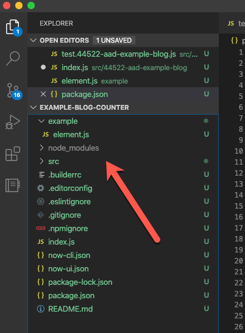

Welcome to my third blog post on the Now Experience. Part 2. Yes, I know it's confusing. If you haven't, check out [Part 1](../2020-03-20-nowui-part1) and/or [Part 1.5](../2020-03-24-nowui-part1point5) before continuing. We are going to cover a lot here, but not what has already been covered :smile: 

For those joining us here, you'll need the following:
- An environment set up to run the [Now-CLI](https://docs.servicenow.com/bundle/orlando-servicenow-platform/page/build/components/task/set-up-environment.html) with my settings from [Part 1](../2020-03-20-nowui-part1)
- VS Code and Git (optional, but c'mon, don't be like that)
- An understanding of Javascript and ServiceNow
- A ServiceNow Instance on the Orlando Version (Guide for your FREE PERSONAL INSTANCE [HERE](https://developer.servicenow.com/dev.do#!/learn/courses/orlando/app_store_learnv2_buildmyfirstapp_orlando_build_my_first_application/app_store_learnv2_buildmyfirstapp_orlando_servicenow_basics/app_store_learnv2_buildmyfirstapp_orlando_personal_developer_instances))

We will be creating a basic component, and I'll be running through the WHAT and WHY of what's going on in more detail. 

Now (haha, like the Experience, and the platform...) Let's get cracking!

## Getting Cracking

Let's start at the beginning, and follow a simple, step by step process :wink:

### Step 1: Make a Place and Init That Git! 

In your "projects" directory, create a new folder called something like "example-component-counter" sticking to that "Kebab-case" we mentioned in my previous blog. Open that up in Visual Studio Code and follow the steps from my last blog:

- Open the folder in VS Code
- Switch to the Source Control tab and hit the big *Initialize Repository* button
- Open the Terminal in VS Code by going "View / Terminal" or Ctrl+`

> HOT TIP: Using the terminal in VS Code is awesome, because it's already pointed to the folder you have open, and it keeps everything together! You will see how useful this is shortly.

### Step 2: Loggity Inn

We need to log in to our instance via the CLI to allow it to validate everything as we BUILD STUFF. 

In the terminal, type:

`now-cli login --host "https://your-instance.service-now.com" --username "your-username" --password "your-password"`

You should get a tick, and a note about saving the credentials. Something like:


> This login can be OAuth I think, but, no, I'm not helping with that soz :wave:

### Step 3: Understand, and Scaffold

The next step is using the CLI to "Scaffold" our new project. BUT... and there's always a :peach: - We need to know what we want to make.

The [Dev Docs](https://developer.servicenow.com/dev.do#!/guide/orlando/now-experience/cli/now-cli/) lay out a few things we need to know first:

- We need a `Name` (The bane of Developers)
  - This *should* be a "Valid and Unique" [NPM package name](https://docs.npmjs.com/files/package.json). This is a guideline if you plan on sharing your component to the greater community, and may or may not be super critical. Let's just stick with it for now. I'm going to use my initials and package name e.g. `@aad/mypackage`
- We need a `Description` (A bit easier)
- We could also specify a `Scope` (The ServiceNow one)
  - This is limited to 18 characters, and is validated against the instance you have logged in to
  - Must follow the form x_customerprefix_componentname - MORE ON THIS SOON
  - If you leave it blank, it'll generate one for you. Let's do this for simplicity
  - Full disclosure: I tried to generate one and the CLI wouldn't let me. Probably needs to be done in the instance? 

> EXTRA CREDIT: To find your Customer Prefix - Check the System Property in your instance here: 
> ```
> https://your-instance.service-now.com/nav_to.do?uri=%2Fsys_properties.do%3Fsys_id%3D8fc888b2d77311004f6a0eca5e6103e6
> ``` 
> under the "Value" field

We are going to use the name `example-component-counter` as that's what we called our folder.

Now we MAKE SOMETHING: Create your component "Scaffolding" using the Now-CLI by running the following command in the VS Code terminal:

 `now-cli project --name "@aad/example-component-counter" --description "It's what it says on the lid"`

You should see a bunch of text go flying by, and a few notes like "Scaffolding Complete!" and "blah blah do stuff blah blah". You will also note, if you are paying attention, that a WHOLE MESS OF CRAP just landed in our directory! That's your new component!


### Step 4: What just happened?

Right, so we have heard of and seen "Scaffolding" in action, now what did it do? 

> The CLI has created all of the basic files and code needed to get started developing our Now Experience component.
> 
> You could do this by hand, but honestly, very no thank you. 

Let's get a basic understanding of all this stuff that's in our component directory now:

```
|____example
| |____element.js
|____src
| |____44522-aad-example-blog
| | |____index.js
| | |____styles.scss
| | |______tests__
| | | |____test.44522-aad-example-blog.js
| |____index.js
|____.builderrc
|____.editorconfig
|____.eslintignore
|____.gitignore
|____.npmignore
|____index.js
|____now-cli.json
|____now-ui.json
|____package.json
|____README.md

```

Firstly, the `example` directory is fairly obvious. It contains an example element. We'll get to that later.

The `src` folder holds all the "Source" or "Code that actually does something" for our component. This is where we will be spending most of our time working. Under `src` is a directory generated with the name of your component and your customer prefix, and a file called `index.js`. You are going to see this a lot.

> index.js is a default name that our builder will look at inside directories using to render our components. It can be changed in some circumstances, but let's not for now.

The `index.js` in the root level of your `/src` directory is used for pulling and serving all your components and sub-components to the ServiceNow UI.

Inside THAT folder is an `index.js` and `styles.scss`. This is where the *specific* magic happens for our component. We'll have a look at that in Step 6.

Next up in the root directory we have a bunch of "Dot Files". 

> Files starting with a "." have become an industry standard for configuration files in many new tech stacks, like Now Experience.

- **.builderrc**: A file which tells a Node Application called [Builder](https://github.com/FormidableLabs/builder) what to do. I haven't seen this before, but my guess is it's used to help compile and run the component.
- **.editorconfig**: Some basic configuration for your editor, in this case, VS Code. It's used to set some character and style defaults for .js files, and .md files. This should happen automatically.
- **.eslintignore**: The first "Ignore" file. This tells another app (ESLint) not to do it's thing with certain files and folders. It's thing, in this case, is [Linting](https://en.wikipedia.org/wiki/Lint_(software)) (Checking your code for style and bugs). 
- **.gitignore**: This file tells Git (as we previously set up and initialized) not to upload certain files and folders to your repository. I'll get into the details of this in a bit
- **.npmignore**: This file is used to tell NPM (the Package Manager) not to include certain things when you are *publishing a package*. Probably not a huge deal for us right now, but maybe in the future.

That brings us along to another "index.js" - this one is pretty empty. Let's just leave it for now, it'll give all the other index.js's someone to play with.

The next two files: **now-cli.json** and **now-ui.json** are much more important. 

> JSON stands for "JavaScript Object Notation" and is a way of representing data. These JSON files contain data that is used in telling the instance what our component consists of, and storing configuration.

- **now-cli.json**: This contains the configuration information for the Now-CLI. It stores login information and references unit testing and themes.
- **now-ui.json**: Arguably more important than a lot of the other stuff, this stores the name of your component, and any "inner" or sub-components. 

ignoring the next file for a second, we have `README.md`, another standard for repositories is to include some basic documentation. GitHub parses this file automatically, and creates the details you see under the files in every repository. We even made one in [Part 1.5](../2020-03-24-nowui-part1point5/). This is somewhere you can have fun. Link gifs, make jokes. It's just the Readme!

### Step 4.5: `package.json`

This file is special, and deserves it's own heading. Back in [Part 1](../2020-03-20-nowui-part1.md) of the series we talked about Node Package Manager or **NPM**:

> package.json file is what NPM uses to understand what your package is, dependencies a Now Component needs to run on your local computer. NOTE: It's a whole friggin' lot of them (excuse the language)

Let's have a look inside: 

The first section is fairly simple: 

``` json
{
  "name": "@aad/example-blog",
	"version": "0.0.1",
	"private": false,
	"description": "It's what it says on the lid",
	"keywords": [
		"ServiceNow",
		"Now Experience UI Component",
		"@aad/example-blog"
	],
	"readme": "./README.md",
	"engines": {
		"node": ">=8.6.0",
		"npm": ">=5.3.0"
  },
```

Details about your component, version, the description you entered before, and what "engines" are needed to run it. 

The second half:

``` json
{
  "module": "src/index.js",
	"dependencies": {
		"@servicenow/ui-core": "orlando",
		"@servicenow/ui-renderer-snabbdom": "orlando",
		"@servicenow/cli-archetype": "17.0.1",
		"@servicenow/cli-component-archetype": "17.0.1",
		"@servicenow/sass-theme": "orlando",
		"@servicenow/sass-kit": "orlando",
		"sn-translate": "orlando"
	},
	"devDependencies": {
		"@servicenow/cli-archetype-dev": "17.0.1",
		"@servicenow/cli-component-archetype-dev": "17.0.1"
	}
}
```

The bread and potatoes of what is actually required to run your component, and some additional "devDependencies" for when we want to developer stuff locally. 

This might not look like much, but imagine, each of those dependencies is another Node Module, with it's own `package.json` and it's own list of dependencies, and those have theirs, and so on and so forth until you realise you are trying to sync 100,000 individual `index.js` files to your Google Drive. It's pretty mindboggling, and that's another reason we use Package Managers and Scaffolding. It's almost the ultimate "don't reinvent the wheel", by referencing other people's hubs, spokes, tyres, and everything they have ever thought of or designed. 

> THOUGHT EXPERIMENT: Who owns the dependencies of these dependencies? Are they open source? Are they coded well? Are there security flaws, and should ServiceNow fix them? These are questions (maybe) time will maybe answer?

Congratulations! That's all the files which were created in the Scaffolding process, and you might even understand what they are and why they are there. Let's jump blindly into the next abyss!

### Step 5: Blah Blah Do Stuff Blah Blah

Remember back in [Step 3](#step-3-understand-and-scaffold) we saw some cool purple text that said to do some stuff? Specifically it says: `Component has been created! Install dependencies using a package manager and then start the dev server by running "now-cli develop"`

Imagine, if you will, you are fairly new to CLI tools and command line. Now, what would happen if you missed that one line of text, or you didn't understand what it meant? Errors of course! You would be stuck, and nothing would work. *Obviously*

Luckily, we don't have to imagine because you are following my blog and you know that we have dependencies, they are stored in `package.json` and we need them for our component to work. 

Let's do what the CLI suggests and INSTALL THOSE DEPENDENCIES: 

> run the following command from your terminal in VS Code: 
> 
> `npm install`

You should see a whole bunch of stuff happen, and finish with something like this: 


No, you don't need to understand it. Yes, it is worrying that there are so many warnings. Yes, seriously, 2953 packages. Yes, again, seriously 9560 vulnerabilities. Does this matter? Well, ServiceNow doesn't seem to think so. There has been mention (From the Developer team inside ServiceNow) that the CLI is on a monthly update schedule, and should hopefully be maintained fairly rigorously. I guess we will find out. 

So what happened? You should see a new folder:



inside it, if you dare look, are all the components in their respective folders that your component and it's sub-components needed to run. Yes, it's cyclical, but it ended somewhere (... around the 100k file mark)

You may also notice it's grey. This is because the `node_modules` folder is listed in your `.gitignore` and it won't be pushed to GitHub when you upload your work. *thank goodness*

### Step 6: At last! Let's make something appear!

Finally, somewhere near 5000 words of blog, and we might actually see fruits for our labour. 


The whole reason we are setting up this whole shebang is to DEVELOP a COMPONENT. The reason we do it locally is to SEE WHAT WE ARE DEVELOPING LIVE. 

> Run the thing using the command `now-cli develop --open`

You should see some more files appear in your project, and a browser window should pop open and... *drum roll* Congratulations! The page is empty.

This is due to 2 reasons. 

1. We haven't added any code to our component and...

<div style="color: red; font-size: 2em; text-align: center;">:stop_sign: STOP: BIG WARNING! :stop_sign:</div>
<div style="color: #ffcccb;">
When this blog was posted (March 26th, 2020), there is a BUG with the Now-CLI when using it with a Personal Developer Instance. Read [Andrew Barnes' Blog](https://developer.servicenow.com/blog.do?p=/post/pdis-and-components/) with the fix for this. We will do this next
</div>

For this fix we need to change our Component name in 2 places to have an `x-` in front, as straight numbers will cause the component to error.  

Open the file `src/12345-component-name/index.js` and make the change as I have in the comment here:

``` js
import {createCustomElement} from '@servicenow/ui-core';
import snabbdom from '@servicenow/ui-renderer-snabbdom';
import styles from './styles.scss';

const view = (state, {updateState}) => {
	return (
		<div>Hello!</div>
	);
};

//createCustomElement('44522-aad-example-blog', {
createCustomElement('x-44522-aad-example-blog', {
	renderer: {type: snabbdom},
	view,
	styles
});
```

then open the file `example/element.js` and change it as follows:

``` js
import '../src/44522-aad-example-blog';

const el = document.createElement('DIV');
document.body.appendChild(el);

/* CHANGE FROM THIS:
el.innerHTML = `		
<44522-aad-example-blog></44522-aad-example-blog>
`;
*/

el.innerHTML = `		
<x-44522-aad-example-blog></x-44522-aad-example-blog>
`;
```

As you make these changes you may notice your terminal updating with the following lines: 

```
ℹ ｢wdm｣: Compiling...
ℹ ｢wdm｣:                                                                           
ℹ ｢wdm｣: Compiled successfully.
```

> This shows that as we change files, it dynamically compiles and you can see the updated component LIVE!

If you still have your browser open from before (hint: [http://localhost:8081/](http://localhost:8081/)) You should notice, well, it's still empty, BUT! The errors have been fixed.

**Now, on with our previously scheduled entertainment**

Let's do that thing that every developer does when they are starting a new Project: ~~dash dash version~~ Hello World!

Open the `index.js` file inside the `/src/1234-yourmodule` folder, and on Line 7, between the `<div></div>` tags, type "Hello World! Finally, Amirite?" Your terminal will let you know it's recompiled, and you should see something magical in your browser:


Wow. Just wow. You are the non-gender-specific human of the hour! Give yourself a pat on the back, take a drink, let's celebrate for a second :tada::tada::tada:.

Right, now click into your terminal and  hit "Cmd/Ctrl+C" to kill that running process.

## Wrap up

Honestly, I had more planned for this blog. But wow, 2500 words and we have come so far. Done so much. Our browser has text in it! 

In summary, we have:

- Made a project directory and picked a name (Harder than it sounds)
- Logged into a PDI via the Now-CLI 
- Scaffolded a new Now Experience Component (Come on! So Awesome!)
- UNDERSTOOD what the crap that scaffolding did! (Even cooler! Amazing! You're so great!)
- Installed all the dependencies that are required to run and develop the components live on your computer
- Fixed a problem with using the components and a Personal Developer Instance
- Said Hello World! 

At last, we can do a little bit of housekeeping, and rest. 

### (Extra Credit) Step 7: Push that Git

Following the steps in [Part 1.5](../2020-03-24-nowui-part1point5) throw that badboy up on GitHub ([Here's Mine](https://github.com/dorsy99/example-blog-counter)) - and comment your repository link on this blog! I want to go star a WHOLE BUNCH OF COOL PEOPLE'S STUFF. 

Love you all so much for sticking with us this far! See you in **Part 3: Oh yeah, that's right, I'm meant to be a ServiceNow Developer**

`- Andrew`

<!-- I think it's only fair to start at the beginning, and utilise what our friends at the ServiceNow [Developer Program](https://developer.servicenow.com) have made and hit up the [first example](https://developer.servicenow.com/dev.do#!/guide/orlando/now-experience/ui-framework/examples/counter) which is a simple Counter app. We might *zhoosh it up* a bit by using an Out of the Box button, but we'll see how we go :wink:. -->