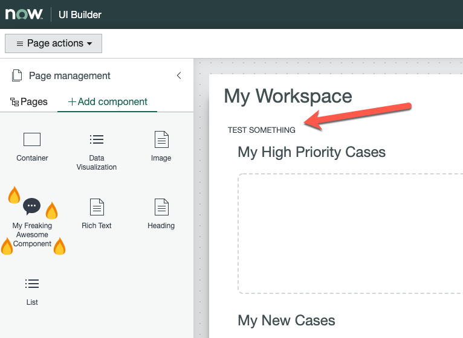

If you have been following along with [my](./../2020-03-20-nowui-part1) [blog](../2020-03-24-nowui-part1point5/) [series](../2020-03-26-nowui-part2/) on the Now Experience (Congrats if you have! :tada::tada: I know it's a long read), you may have started thinking to yourself, or yelling out loud into the void "BUT WHAT ABOUT SERVICENOW? WHAT ABOUT THE PLATFORM? WHERE IS MY INSTANCE? WHY DO I EXIST!?" and I want you to know, **you are heard**. 

This post I'm going to talk a little about how to get your components to your instance, and I was planning to digress into a whole rant about my thoughts on the current state of Now Experience, but rather than that, I have a little surprise. (Scroll down if you want the surprise and don't care about the other details. I understand. It's fine. Whatever.)

## Publishing Your Component

Right let's do this! You have "Hello"'d the  :earth_asia:with a :wave:- Now we want to see that in our Instance. Luckily, our old friend the Now-CLI has that in hand. 

Make sure you have logged into your instance (follow the steps in [Part 1](../2020-03-26-nowui-part1)) and give the CLI the magic command: `now-cli deploy`. 

You should see something like this:


The things to note are the lines in green: 
```
Creating 4b8ec5da08d47d55cd6a57f11a4552ab in sys_ux_lib_source_script
Creating 331b5f9d4137b1361b099ecf2aa4386b in sys_ux_lib_component
```

> For a little more info on these tables and how they relate to an instance, check out an [in-depth blog](https://medium.com/@pishchulin/servicenow-ui-framework-be88f466be01) by my fellow Developer MVP [**Andrew Pishchulin**](https://medium.com/@pishchulin/)

## What Just Happened?

Based on the fact you are reading this, you'll probably recognise these as two entries (sys_ids) in two tables. The Now-CLI has connected to your instance and pushed your fresh, hot & steamy  code to records in tables! Exciting!

Let's go see what's happening - Open your instance and navigate to "Workspace Experience" / "Administration" / "Landing Pages". Open one, and click the "Open UI Builder" button. Then switch to the "+ Add Component" menu and.......


Yep. Not there. Here's where ServiceNow are planning for the future, and have created *classes* of components, and because we haven't specified exactly what class our component is, it won't show up in the Workspace Builder. 

> HOT TIP: While you are here, clone the UI page you opened and make it editable, call it something like "test" so we have somewhere to put our component once we fix this bug.

## Ugh, Fine, Let's Follow the Docs

You can see the [Now Experience Guide Page](https://developer.servicenow.com/dev.do#!/guide/orlando/now-experience/cli/ui-builder) and what ServiceNow is looking for this on the Developer site. Let's do what they suggest and update our `now-ui.json` to tell the instance we want it to be a "uiBuilder" component:

``` json {hl_lines=["5-10"]}
{
  "components": {
    "<your_component_name>": {
      "innerComponents": [],
      "uiBuilder": {
        "associatedTypes": ["global.core"],
        "label": "My Freaking Awesome Component",
        "icon": "chat-fill",
        "description": "So awesome it almost doesn't serve a purpose!"
      }
    }
  },
  "scopeName": "<your_scope_name>" 
}
```

As you can see in the highlighted lines, we are setting the component type to `global.core` (from the docs: Used for base components that are applicable in all contexts, such as Design System components.) and giving it some more details. In my tests I haven't been able to get the icon `chart-forecast-fill` to work and ~~there doesn't seem to be a list of available icons~~ **The list of available icons is** [**HERE**](https://developer.servicenow.com/dev.do#!/reference/libraries/orlando/now-components/now-icon/gallery) - I'm going to use `chat-fill`.

Once you have updated your `now-ui.json` let's re-push those components and see if we have the magic: run `now-cli deploy`. 

Whoops. We've just hit another fun tidbit with the CLI - It doesn't let you re-deploy stuff without a "force" command - if you read the last few lines of the error, try what it suggests: `now-cli deploy --force`.

## Does It Work This Time?

Now let's head over to our UI Builder and see what we can see!



As you can see, our component is there and we can drag it on to the canvas (Assuming you have cloned and made writeable a new UI page). 

Exciting isn't it? 

That's about it when it comes to making your component accessible in your instance. You build it, and deploy it, then use it. I'm sure there will be lots of different places they can be used, and much more interesting documentation to come in later versions of Now Experience and ServiceNow itself, but for now, that's it.

## But What Do I Think, Really?

My original plan was to write a whole bunch of conjecture and surmises about the Now Experience, but I know text can never really portray how unsure I am about what I'm talking about, so I asked my friend [Jace Benson](https://jace.pro) to join me in a live stream and have a chat about the whole thing, and answer some community questions I've seen popping up. 

I encourage you to have a listen (you don't need to watch, it's just us talking, plus some shrugs) and if you have any questions, please let me know in the comments on the video or below in this article. We are more than happy to say things on the internet again!



Thank you again for reading. 

`- Andrew`

> Additional Note - I have set up [Brave Rewards](https://brave.com/brave-rewards/) on the site, and my YouTube channel. It's an easy (and kinda free!) way for you to show appreciation for what I'm doing. No pressure - I love you either way :heart: