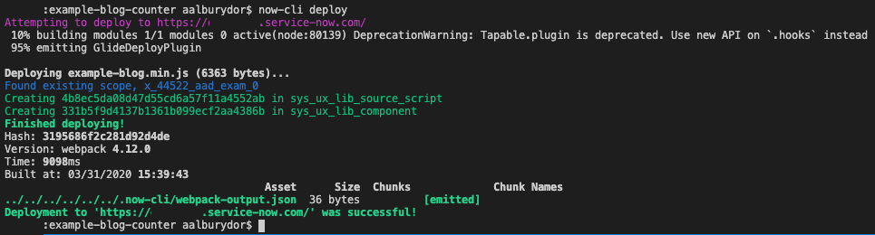
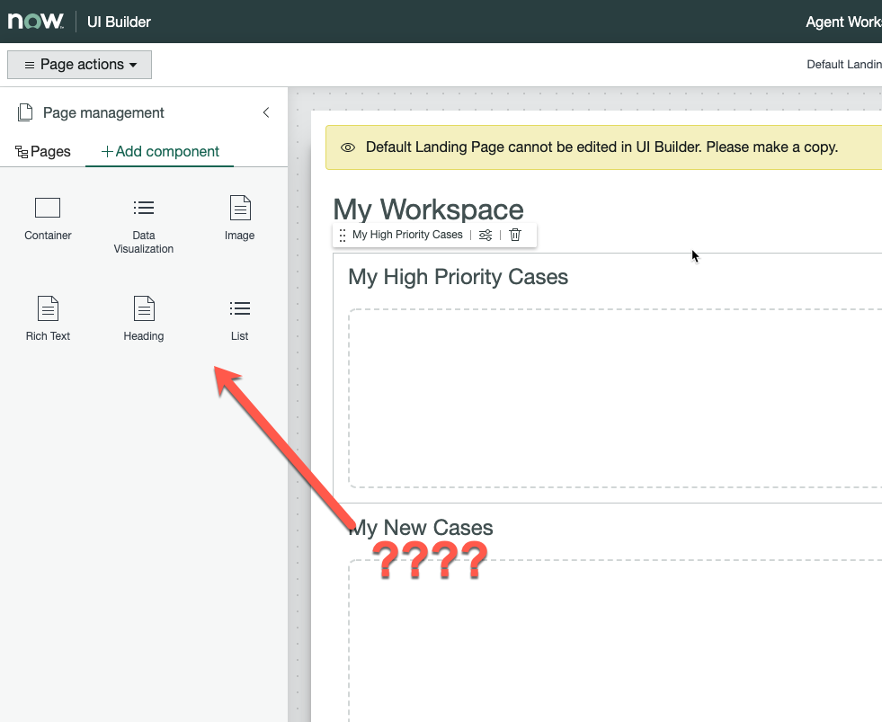

If you have been following along with [my](./../2020-03-20-nowui-part1) [blog](../2020-03-24-nowui-part1point5/) [series](../2020-03-26-nowui-part2/) on the Now Experience (Congrats if you have! :tada::tada: I know it's a long read), you may have started thinking to yourself, or yelling out loud into the void "BUT WHAT ABOUT SERVICENOW? WHAT ABOUT THE PLATFORM? WHERE IS MY INSTANCE? WHY DO I EXIST!?" and I want you to know, **you are heard**. 

This post I'm going to talk a little about how to get your components to your instance, and I was planning to digress into a whole rant about my thoughts on the current state of Now Experience, but rather than that, I have a little surprise. (Scroll down if you want the surprise and don't care about the other details. I understand. It's fine. Whatever.)

## Publishing Your Component

Right let's do this! You have "Hello"'d the  :earth_asia:with a :wave:- Now we want to see that in our Instance. Luckily, our old friend the Now-CLI has that in hand. 

Make sure you have logged into your instance (follow the steps in [Part 1](../2020-03-26-nowui-part1)) and give the CLI the magic command: `now-cli deploy`. 

You should see something like this:


The things to note are the lines in green: 
```
Creating 4b8ec5da08d47d55cd6a57f11a4552ab in sys_ux_lib_source_script
Creating 331b5f9d4137b1361b099ecf2aa4386b in sys_ux_lib_component
```

> For a little more info on these tables and how they relate to an instance, check out an [in-depth blog](https://medium.com/@pishchulin/servicenow-ui-framework-be88f466be01) by my fellow Developer MVP [**Andrew Pishchulin**](https://medium.com/@pishchulin/)

Based on the fact you are reading this, you'll probably recognise these as two entries (sys_ids) in two tables. The Now-CLI has connected to your instance and pushed your fresh, hot & steamy  code to records in tables! Exciting!

Let's go see what's happening - Open your instance and navigate to "Workspace Experience" / "Administration" / "Landing Pages". Open one, and click the "Open UI Builder" button. Then switch to the "+ Add Component" menu and.......



Yep. Not there. Here's where ServiceNow are planning for the future, and have created *classes* of components, and because we haven't specified exactly what class our component is, it won't show up in the Workspace Builder. You can see the [Now Experience Guide Page](https://developer.servicenow.com/dev.do#!/guide/orlando/now-experience/cli/ui-builder) for this on Developer. Let's do what they suggest and update our `now-ui.json` to tell the instance we want it to be a "uiBuilder" component:

``` json 
{
	"components": {
	    "<your_component_name>": {
			"innerComponents": [],
			"uiBuilder": {
				"associatedTypes": ["global.core"],
				"label": "My Freaking Awesome Component",
				"icon": "chart-forecast-fill",
				"description": "So awesome you won't know what to do with it!"
			  }
	    }
	},
	"scopeName": "<your_scope_name>" 
}

```


