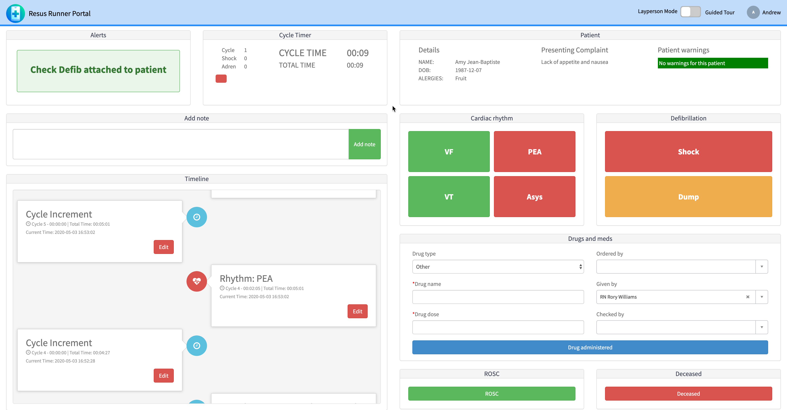

Knowledge 2020. It was meant to be the first time I was able to get overseas to the biggest conference in my professional bubble. Aaand then the world decided that didn't need to happen. For months we were waiting on confirmation that it would go digital, and how that would play out. And sure enough, it did. 

ServiceNow decided that they would take the time to spread everything out into 6 weeks (from 3 days!?). And well... They did that. 

Rather than run you through all the sessions I have been to, I'm going to give you some overall impressions and my opinions.

> Remember. This is MY opinion. How I feel. Nothing Official, so don't @ me.

## THE HACKATHON

Before the conference proper commenced, we had the *Knowledge 2020 creatorcon Hackathon 2020 digital experience hackathon* (Not the actual name, but very long). I was excited about this being my first "real" hackathon and figured I would put a team together from Australia and give it a real go. 

This didn't really happen. I got a few quick "yes"'s from my friends Kevin and Dave, and Kevin invited his friend Chris, but then didn't find anyone else local who was interested in spending a whole weekend doing "work". Luckily, [Jace](https://jace.pro) and Jarod who are fellow Dev MVPs also wanted to join, so we ended up with a team of 6. 

We had a few quick meetings about the idea we were going to try and one was chosen. In Australia the event ran from 7am Saturday till 2pm Monday, which worked out pretty nice. We didn't push anyone too hard, most people worked about 7 or 8 hours during the day, and I think it came together well. 

I would like to get into technical details about our entry later on, but for now, you can see the app on my [GitHub](https://github.com/dorsy99/ResusRunner) and the [YouTube presentation](https://www.youtube.com/watch?v=WlVHE1ZM4GE).

While our team were happy with the app we made, we didn't win any prizes. My understanding is the Healthcare category we participated in was by far the biggest, and the ol' rules'n'regs'n'terms'n'conditions meant only a single "winner" could be picked from that category. So be it. 

We enjoyed our time, but the judging process was completely invisible to everyone who wasn't a finalist or winner. From my understanding, the in-person hackathons everyone is there to watch the judging. That would have been better.

A few things I learned: 
- Don't leave your pitch video till very last. Wowza. Stressmuch.
- Working across timezones is very doable, but having a good work management platform helps. We used Agile in my PDI and that helped
- No matter who you are, you learn things every day. Everyone on the team came out of the hackathon with new skills.

Some other things to consider / negatives:
- If the event had run the weekend before the actual conference, international people travelling to the conference wouldn't have been able to attend
- The judging wasn't very transparent. We didn't see what anyone else had done, and didn't hear anything until the official announcement "video" during Week 2 of the conference
- The announcement video was... lacklustre. There were 2 minute pitches, and the judges asked one or two questions. The winner didn't even seem to have done that much development (although I'm aware they did)

## THE CONFERENCE

So here's where I'm going to get a bit cynical. When I first heard K20 was going digital, I was super excited. I thought I'd be throwing out my body clock, waking up at midnight to do 8 hours of live events, hang out with people in "chat rooms" and really smash a few days of ServiceNow content. When the extended timeframe and "First weeks content" were uploaded to the Knowledge agent builder, I didn't log on instantly as it was during the evening in Australia. The next day when I went to peruse the available sessions, everything was taken. Not to mention, the knowledge website was throwing "Single Sign-on" log ins every 5 seconds, and didn't offer an easy-to-use search. ...And the time zones were a bit whack. The same content was available multiple times, for different regions. 

It really deflated me. I found it super difficult to "pack" a day with events, and the pre-recorded style just didn't resonate with me. Honestly, by Week 2 (The CreatorCon) I kinda lost the drive. It almost felt like too much effort to try find things. 

A few events I did participate in (And loved!):
- [CreatorCon Live Coding Happy Hour](https://www.youtube.com/watch?v=ZUezZqW6y8Q)
- A "Now Creators Success Meetup" hosted by AJB about the Dev program and Creators program
- Some non-official meetups with Jace via "Virtual Reality" that he shared on Slack

### But Wait...

Around Week 3, Jace updated his [Super Amazing News Feed](https://jace.pro/news) to include [ALL KNOWLEDGE 20 STREAMS, WITHOUT LOGGING IN!!! :tada::tada::tada:](https://jace.pro/news/?text=Knowledge%2020)

This really changed the game. Want to know what's new in ITOM Visibility? Bam. What about Flow Designer? Whamo. One click watch the videos. And my understanding is this will be available for at least the next few months. Amazing.

I've watched maybe 10 more sessions over the last week or so via Jace's news feed, and that's made it a lot easier. I know it doesn't report back to mothership or offer you surveys (and if you love something, you 100% should do the survey for the person who made it) but it's just infinitely easier to digest.

That brings me to...

## FINAL THOUGHTS

Honestly, I really hope next year's Knowledge goes back to how it was, even if I can't go. I'm more than happy to have a digital offering at the same time, but for me taking a few days off work and cramming the content is worth more than spreading it out thin over 6 weeks. Live > pre-recorded and Networking is a must!

I love ServiceNow, I love the community, and I love the Developer Program. I just wish I could have been there in person. 

`- Andrew`
