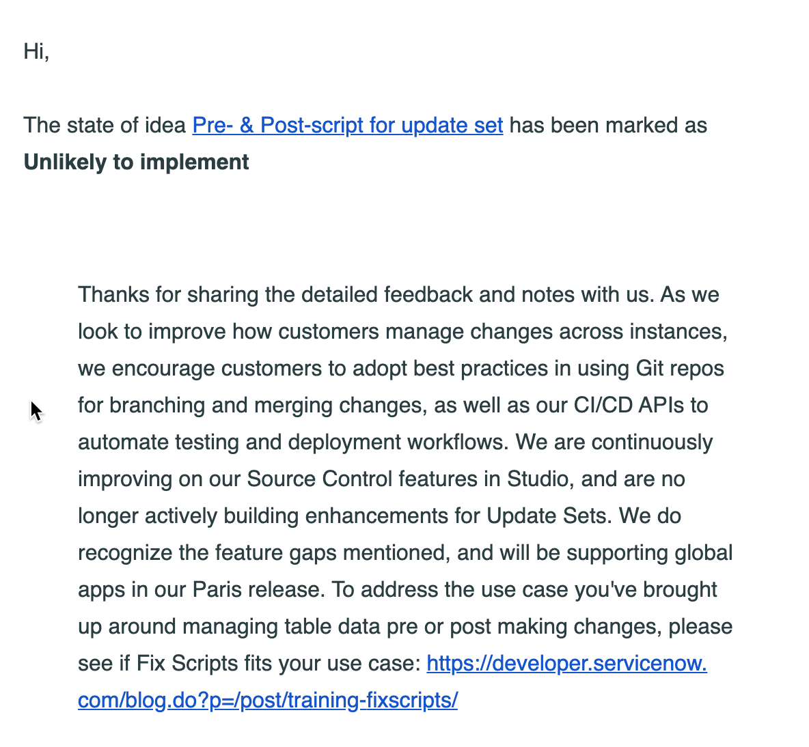

And so, like the grains of sand through the hour glass, another ServiceNow major release is around the corner! This time it's distinctly Euro in it's flavour.

</img>

If you are anything like me, you have registered for the Early Access Release program, and might have seen a similar email hit your inbox recently. It got me thinking, what have I heard around the traps about Paris, what would I like to see, and what *SpOoKy pReDiCtIoNs* can I guess?

## CI/CD is coming in hot!

In Orlando ServiceNow introduced a CI/CD APIs and a spoke allowing users to run ATF tests, and push apps between environments. This was obviously the first stage and more is coming. If you have your ear to the ground, you can smell this on the wind (mixed metaphors, much?). Here's an email I got about an idea I follow:

The big selling point: `We will be supporting Global apps in our Paris release`. **This. Is. Huge.**

Ever wanted to publish a global-scope thing to github? 

Have multiple developers working on something with code merge in Global? 

Want to use the VS Code extension on your Change Management extensions? 

WANT TO MAKE SERVICE CATALOG ITEMS BETTER!? 

This opens SO MANY POSSIBILITIES!

## Now Experience takes a back seat

Something else I've seen bandied about is there won't be any major updates to the Now Experience in platform. UI Builder will still just be UI Builder for Workspace. I wouldn't be surprised if there are a few more components on offer (maybe 5 or 10, think Icon Links or HTML boxes) but don't expect the world. The world is coming in Quebec ;)

## More Workspaces

This is just an easy one to score a few more future points, every release has more workspaces now! I reckon they could almost introduce an "Admin" workspace, but I'm not holding my breath.

Now my more outlandish, not-backed-by-fact predictions: 

## Change Management 2.0?

ServiceNow have been talking about updating Change Management for Agile, DevOps, Container-y things for a while. They have released a few features (stage flows in Problem v2, CI/CD things) which could support this, but I don't have any firm reason to believe. If it's not this release, I think it might be another 12 months away. 

## Creator Studio

Creator Studio will probably be "Studio 2.0" and should have better integration to new things (Flow Designer, UI Builder, Agile 2.0 etc). This is something I've heard about around the place, but I think it could be a lot further away than Paris. It *could* come with Global Scoped Apps, but again, I have no firm basis for this.

## A new Plugins/Apps interface

Honestly more of a wish-list item than a prediction, but the "All Apps Management" page is a bit long in the tooth. It could have a tighter integration with "My Company Applications" and version management / CI/CD stuff, and not take 14 years to load or search.

## Workplace Management

The new Facilities Module that's been in the works, after [ServiceNow acquired App4Mation / 4facility](https://blogs.servicenow.com/2020/employee-workflows-will-support-opening-of-workplaces.html). Some of this was released in the "Safe Return to Work" apps ServiceNow have put out for free, but we *could* see (at least an Early Access) available in P. But, I wouldn't put money on it.

## What else?

I mean, there's a bit there to digest, but hopefully the patch notes drop soon and we see some awesome features! That's one of the most exciting parts of my 6 month professional calendar! 

What would you like to see? Tell me in the comments or on [@twitter](https://twitter.com/andrewalburydor)

Keep [Sailing to the Future!](https://www.youtube.com/watch?v=eAbkh4TMRqg)

`- Andrew`