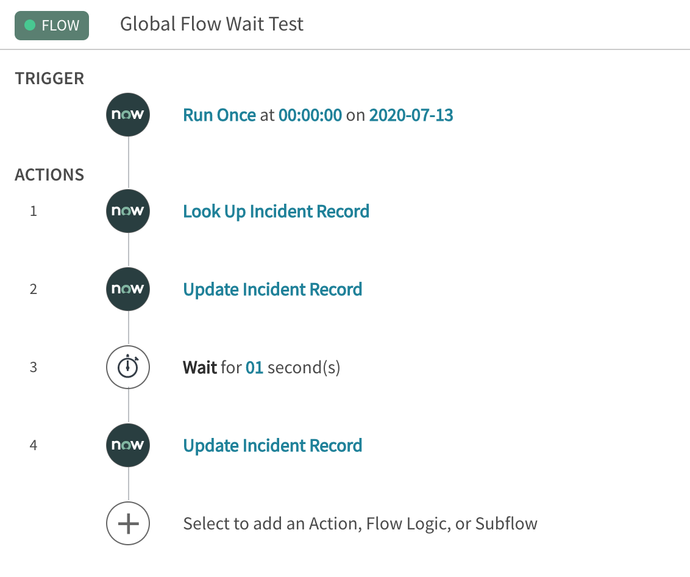
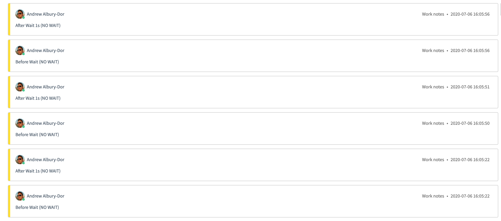
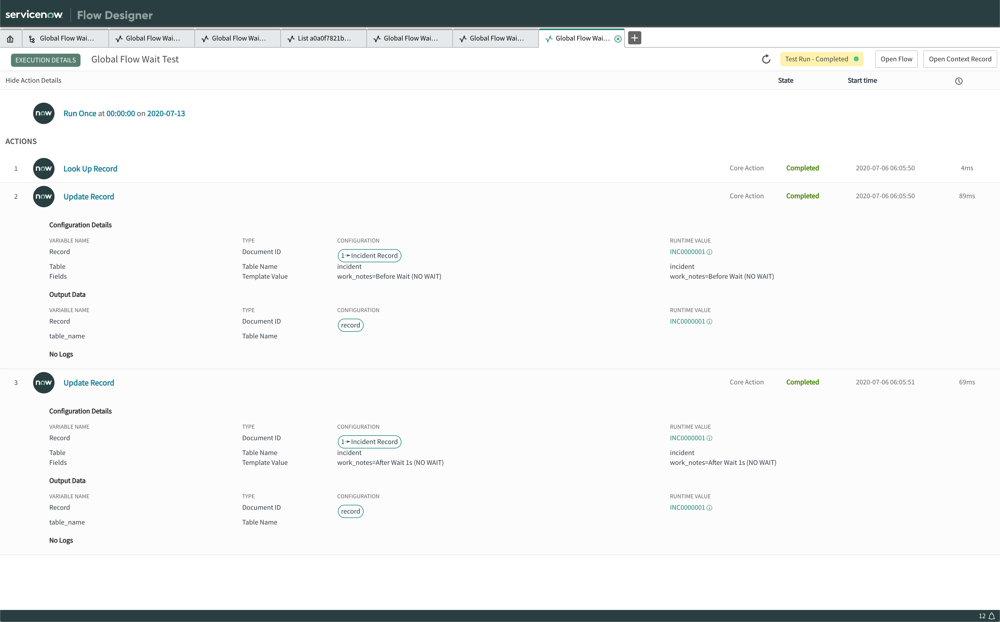
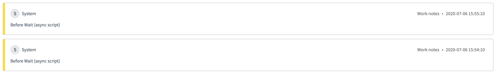
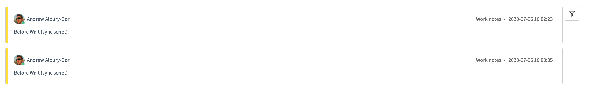
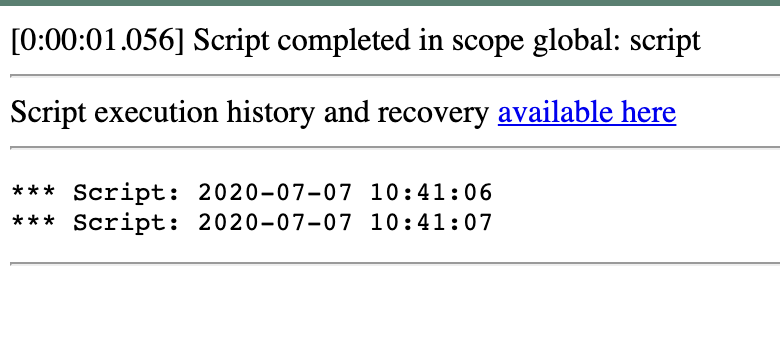
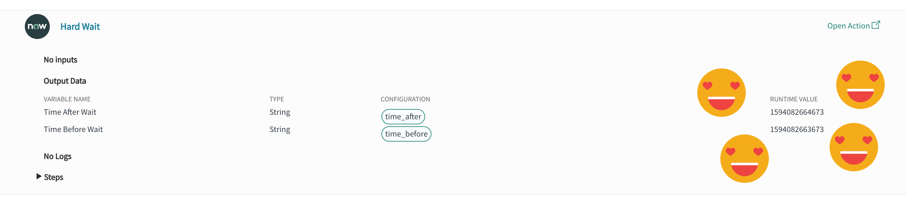
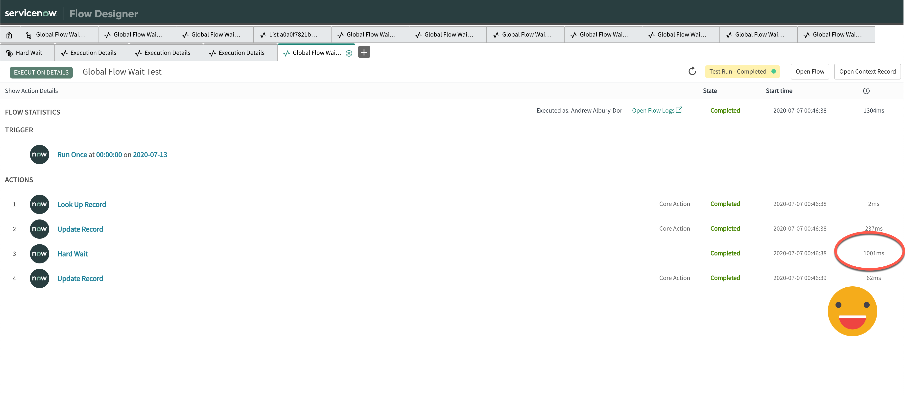
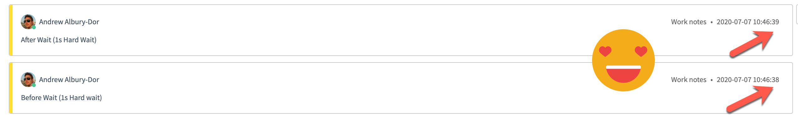
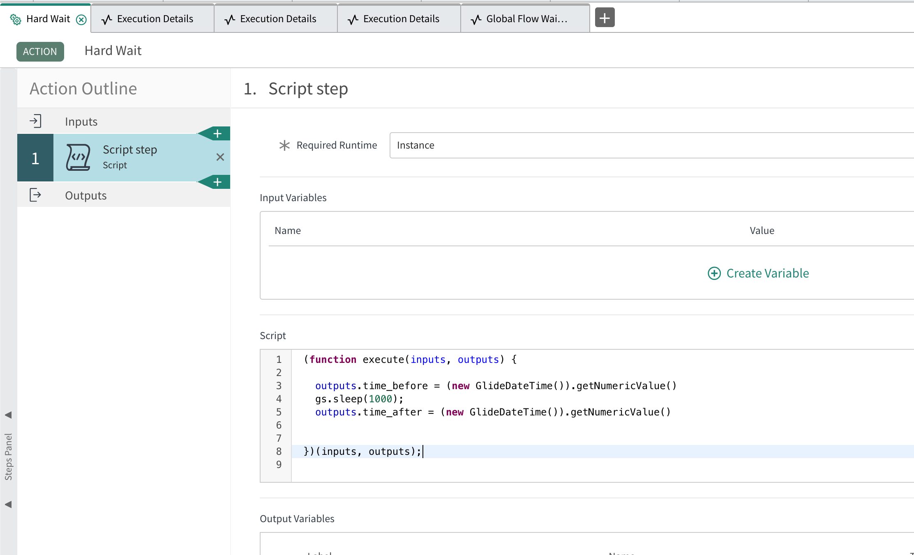

Flow Designer, if you haven't heard from me, is a great tool in the ServiceNow platform. It makes process automation, prototyping and no-code development so fast and easy. Sure, it has it's flaws, but who doesn't? 

What if I told you, when you asked Flow Designer to do something SO SIMPLE as "wait" for 1 second, it (almost) literally **LAUGHED AT YOU** and did **WHATEVER THE HECK IT FELT LIKE?**

## The Reason

I have a flow which calls an API to send a push notification to our 2FA (Okta). It works great, you get the push, happy days. BUT...

We then need to check another endpoint to see what the user's response was, and because it's a real person, not some kind of BUTTON PUSHING ROBOT - that can take a while. In the worst-case of a user IGNORING the push, it expires after a fairly long period of time (**5 minutes!**)

I wrote a 1 second wait into a loop, so at worst, we send 300 polls to the endpoint. It was a quick-and-dirty option, alright?

BUT... and here's where the issue appears. Those waits are taking *forever*. Enter my tests:

## The Setup

I'm running the tests in my Personal Developer Instance, on Orlando Patch 1. The flows have been made in Global Scope, and called via API from Background Scripts. 

Here's my basic test flow: 



I was planning on doing a lot more testing (scope vs global, during loops or not, etc), but I don't think there was much merit in it.

> I wanted to compare waits during: 
> 
> `startFlow` vs `startFlowQuick` and
> 
> `executeFlow` vs `executeFlowQuick`

These all should be Asynchronous and in theory, write two work-notes to a job a second apart. Let's see what happened...

## The Results


### Control - Test Without a Wait
<!--  -->



The flow ran, and it looks to take in the 10's of milliseconds. That's visible in the second update where it's flicked from one second to the next. That's OK with me!


### Flow, Executed by "Test" w/ 1sec Wait:

- 1: 6 seconds
- 2: 8 seconds
- 3: 8 seconds
- 4: 9 seconds
- 5: 4 seconds
- **avg = 7 seconds** 😦

### Flow, async script (`startFlow`): 

- 1: 7 seconds
- 2: 9 seconds
- 3: 10 seconds
- 4: 9 seconds
- 5: 8 seconds
- **avg = 8.6 seconds** 😦😦

### Flow, async script (`startFlowQuick`):


Here's something interesting - doing a Quick never reaches past the "Wait" - even though it's called ASync. Also, it runs as the system user? Who uses this "quick" method and WHY!?


### Flow, sync script (`executeFlow`):

- 1: 5 seconds
- 2: 2 seconds
- 3: 9 seconds
- 4: 7 seconds
- 5: 5 seconds
- avg = 5.6 seconds 😦😦😦


### Flow, sync script (`executeFlowQuick`):


Another interesting note - Running a Synchronous script using the `executeFlowQuick` actually threw an error in the Background Script editor: 

```Flow Designer: Persisting an unterminated plan is not supported for plan with id null and name: Global Flow Wait Test: no thrown error```

This also runs as yourself, vs the System user the ASync one runs as, but still doesn't work. 

### Flow, 10 second wait

For funsies I even changed the wait to 10 seconds to see if it would get a little more tight.


- 1: 18 seconds
- 2: 15 seconds
- 3: 13 seconds
- 4: 21 seconds
- 5: 12 seconds
- avg = 15.8 seconds 😦

### Outcomes

Well, the outcomes are **NOT GOOD**. I am disapointed this is the case, and will have to re-engineer or just accept that we are going to use a lot more (without a wait) / less (with a wait that'll take too long) API calls than we thought.

## The Fix(?)

Here's the magic, right? 

Look at this: 


and this: 


and this:


and THIS!:


### BUT! *DUN DUN DUN*

We can't have nice things.

The magic I was using to get this exact second is the <u>UNMENTIONABLE HORROR</u> that is `gs.sleep(1000)`




And every time that runs, it locks a whole thread in your instance. And that's just not something we can do in Production. No matter how badly we want it, it just feels *icky*.

## The TL;DR

- Flow Designer "Waits" are all crazy asynchronous things that take far too long. Don't wait for 1 second. It's more likely 10.
- The "Quick" options in the API don't really work with waits
- Sync or ASync doesn't matter at the flow level
- 1 second or 10 seconds doesn't matter either
- hard-sleeping a thread works, BUT AT WHAT COST!?
- Just deal with it I guess?

Sorry I couldn't be more help. It's interesting data though, right?

❤️
`Andrew`