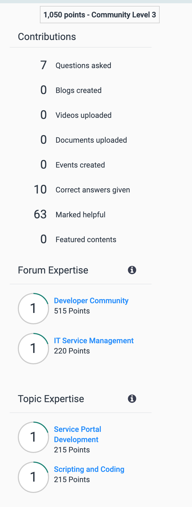
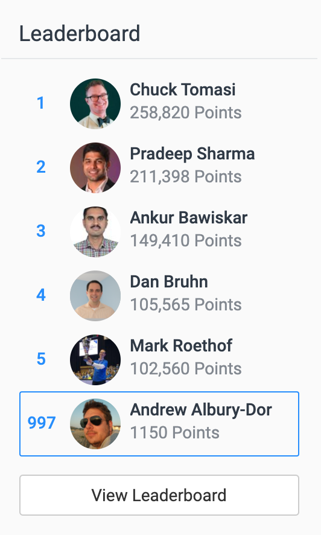

At the beginning of the year I wanted to be more active in [The Community](https://community.servicenow.com/). Up until about a week ago I haven't really been that active. I have definitely been blogging, and doing some videos, and talking on slack a lot, but not so much on the actual community site.

I want to try and change that. 

## My Goal

> I want to get my profile to Community Level 5 (4000 points)

I don't want to put a time frame on it, because this isn't something I want a deadline on. It could take a few months, or longer. It's a personal thing.

## Currently...

Here was my community situation on the 18th of July 2020:

In the last week I've been logging in to community (almost) every day and answering a few questions. Here's my leaderboard standing:

In the next few days, weeks and (hopefully) months, I want to get my Community profile to Level 5.

As of the time of writing, Thursday 23rd of July, I've put on 100 points in about 7 days - I've answered a few questions, and got a few more points, but there's a long way to go. 

## My Plan

- Open Community and check every day for unanswered questions that I can help with.
- Focus on Flow Designer as I'm a self-appointed Fladvocate! I find a lot of questions go unanswered and I want to help people use Flows to solve problems!
- Cross-post some of my blogs as Articles in the Community (I'm going to start with my previous post about Flow wait times, and see if it gets much interaction)
- Keep at it! This is the big one, and should make the biggest difference

Some other things to consider: 
- Do I make up a "Correct answer + helpful" signature, or is that a bit annoying? ~~"SMASH THAT LIKE BUTTON!"~~
- Will this take away from my work? (No....? Helping people helps me learn, and learning is important for my job)

I'll post the odd post on my blog either highlighting awesome stuff, or updating on the progress of my goal. Look forward to it!

So, with no further time wasting - Away I go! If you see me on the community, throw some points my way 😉

💓 `- Andrew`