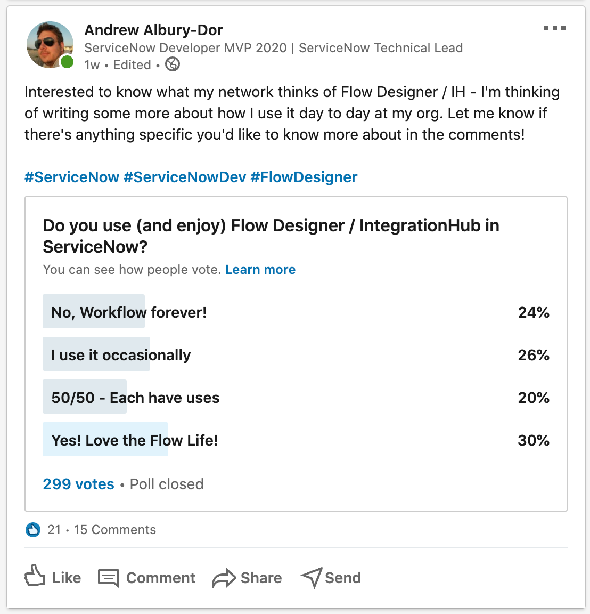
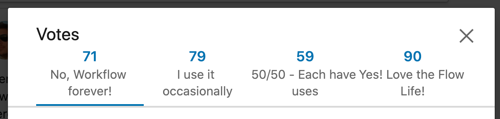

Ahhh, [LinkedIn](https://www.linkedin.com/in/andrewalburydor/). Many people have many opinions. But, one thing I can't deny is that it's a really useful tool for reaching out with a quick poll. And that's what I did when I thought about my upcoming blogs on "Flow Designer". I wanted to gauge the average ServiceNow person's opinion on the tool. 

Over a week, my poll received 299 votes, and the responses were spread **surprisingly** evenly across my four choices. Here's the outcome:

And the exact numbers:

Now I'm super glad that "Yes!" won, but the majority of votes were in other categories. 

As I mentioned in the post, I'm looking to do a small series of posts on how I have used Flow Designer in a day-to-day, and why I believe it's indispensable as a platform feature. This will come soon, but I have some Paris release stuff to do first!

Also, a quick update on my [Journey to Community Level 5](../2020-07-23-journey-to-community-l5) - In the last week or so I have gained a little over 300 points. I've also written [some articles](https://community.servicenow.com/community?id=community_article&sys_id=79f51f7bdbc2109066f1d9d968961980) which have been marked helpful a few times too.

:heart: `- Andrew`