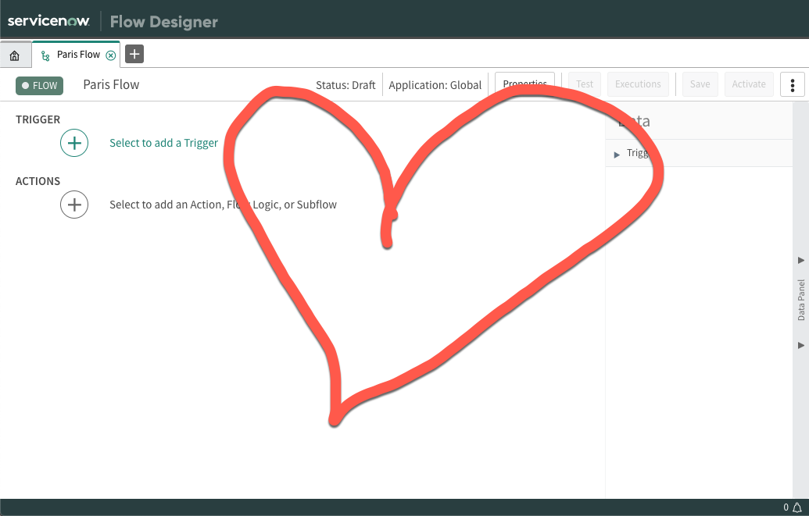

## A beginning

What is it about new things that people dislike so much? I guess I understand, when I first heard about ServiceNow I was very sceptical, coming from a BMC Remedy user background. How wrong was I? (Answer: Very.) And so are the ~50% of people who :open_mouth: *don't like Flow Designer!?*

As per my [Previous Poll](../2020-07-29-flow-designer-poll/) 24% of people seem to actively avoid it, 26% of people only use it occasionally, and 20% of people use it 50/50. **It's my mission to CHANGE THIS**

This series isn't going to teach you the basics. There are [so] [many] [other] [places] for that. What I want to do, is show you why I use it, why I champion the term *Fladvocate*, and why I (honestly, truly) ❤️*Love*❤️ it.

## ❤️
